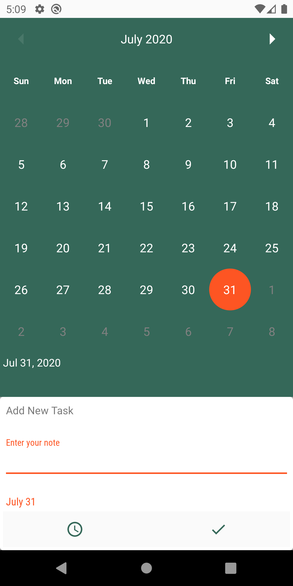

# nTasks

A task, todo, voice notes app published on 2018

# Features

* MVP architecture pattern.
* Cloud sync.
* Easy to access by using shortcuts and home widgets.
* Adding TODO and schedule each sub-task individually.
* Calendar view to have a better perspective.
* Weekly and daily reports to improve productivity.

# Screenshots

# Contribution

Fork this repo and feel free to edit and play in the code base.

